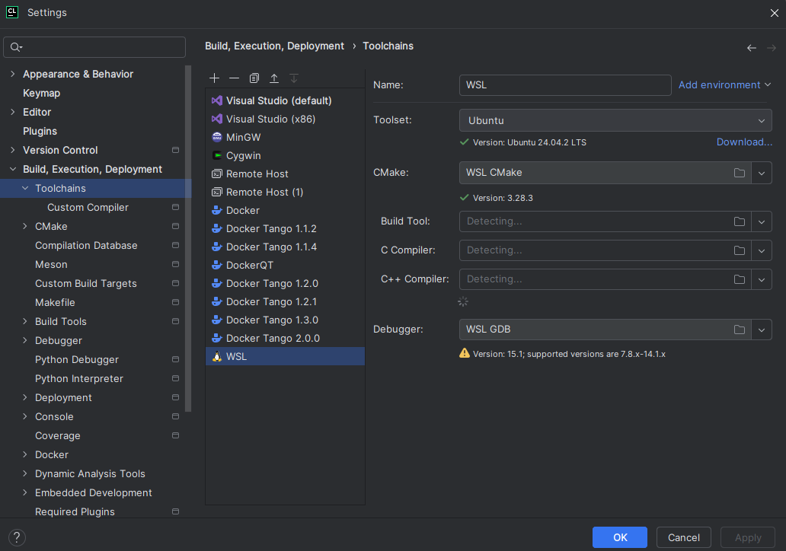
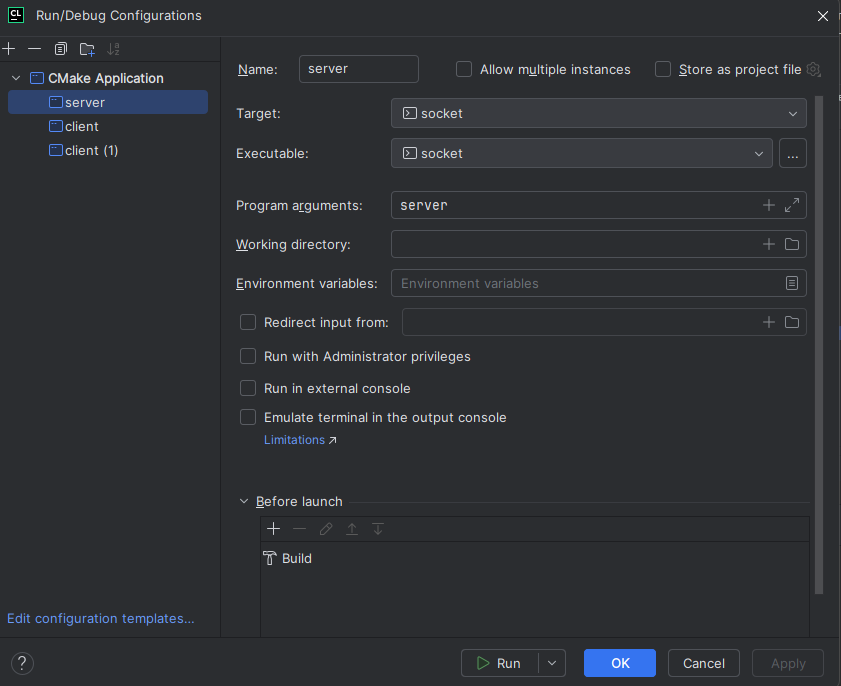

# modbus-socket-lesson
## Задание

Нужно доделать программу, чтобы у сервера было 2 команды `read` и `write`. Это делается по аналогии с командой `test`. 

* Команда `read` должна принимать номер регистра и тип регистра, то есть команда `read 0 HR` должна прочитать 0 holding регистр.
* Команда `write` должна принимать номер регистра и значение (uint16_t), то есть команда `write 0 123` должна записать в 0 holding регистр значение 123.

**Сделать до 13.04.2026**

## Сборка

Так как в программе используется библиотека unistd, то придется собирать под Linux. Самый простой способ установить Ubuntu 24 на WSL и указать в его в параметрах Toolchain.

## Запуск

Для запуска нужно запустить сервер и клиентов. Для удобства используйте настройки запуска. Для запуска сервера создайте _CMake Application_ с _Program arguments_: `server`
Для клиента тоже самое, только вместо `server` указывайте `client`.

